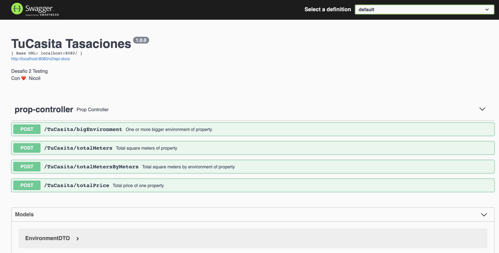

# README


# Hello, I’m Nicoll, and Its my second challenger in Meli!

## Testing Challenger


### 🛠 Description:

TuCasita Tasaciones is a software that help resolve total square meter, the biggest

### Observations:

**By the coverage test, exclude packages Exception and Model**
**You need pass in body request:**

Property requests:

```json
{
    "name" : "Casita1",
    "district" : "Villa Prado",
    "environments":
    [
        {
            "name" : "Habitation1",
            "width": 12,
            "length": 5
        },
        {
            "name" : "Habitation1",
            "width": 15,
            "length": 2
        }
    ]
}
```

### Documentation:

`http://localhost:8080/swagger-ui/#/prop-controller`



# Requirements API rest:

## Total square meters

**`POST`** /TuCasita/totalMeters

**Output**:

```json
{
    "name": "Casita1",
    "Total squeare meters": 90.0
}
```

## Total price by district

**`POST`** /TuCasita/totalPrice

**Note:**  The district must exist in the database, else throw exception.

**Output**:

```json
{
    "name": "Casita1",
    "Total price": 16800.0
}
```

### Exceptions

- `DistrictNotExistException`

## Big environment

**`POST`** /TuCasita/bigEnvironment

**Note:**  If there are one or more environment with the same dimensions, return all with the max area.

**Output**:

```json
[
    {
        "name": "Habitation1",
        "Total square meters": 12.0
    },
    {
        "name": "Habitation2",
        "Total square meters": 12.0
    }
]
```

## Total meters by environments

**`POST`** /TuCasita/totalMetersByEnvironments

**Output**:

```json
{
    "name": "Casita1",
    "environments": [
        {
            "name": "Habitation1",
            "Total square meters": 60.0
        },
        {
            "name": "Habitation1",
            "Total square meters": 30.0
        }
    ]
```

# Glossary exception

- `DistrictNotExistException` District don't exist in a database

Thank You for taking the time to view my project 😄
