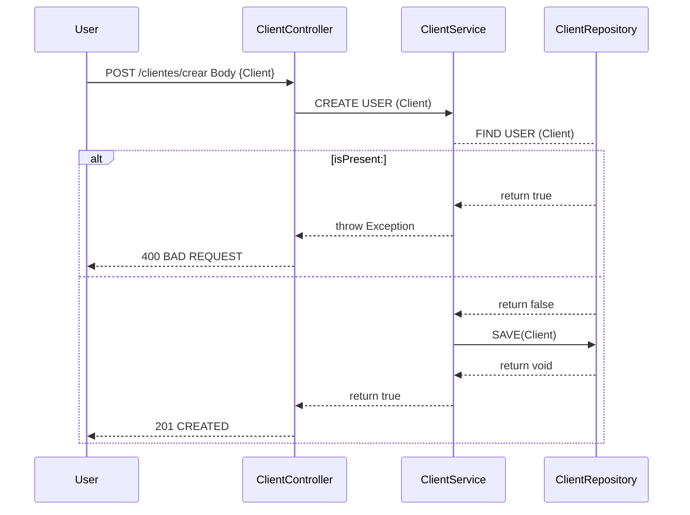
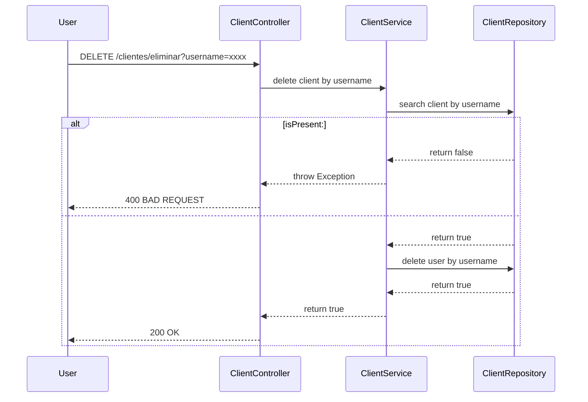
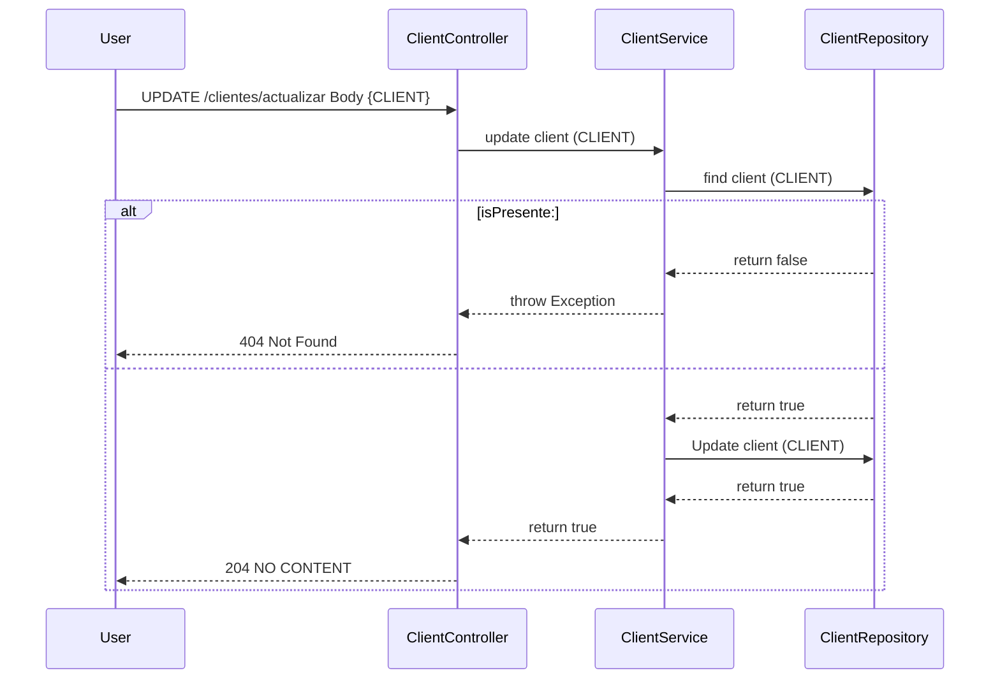
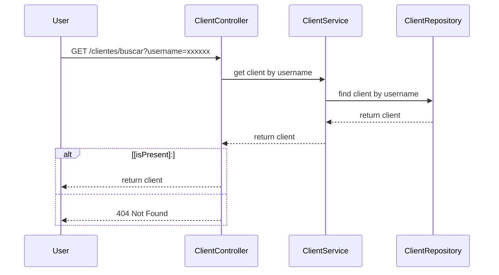
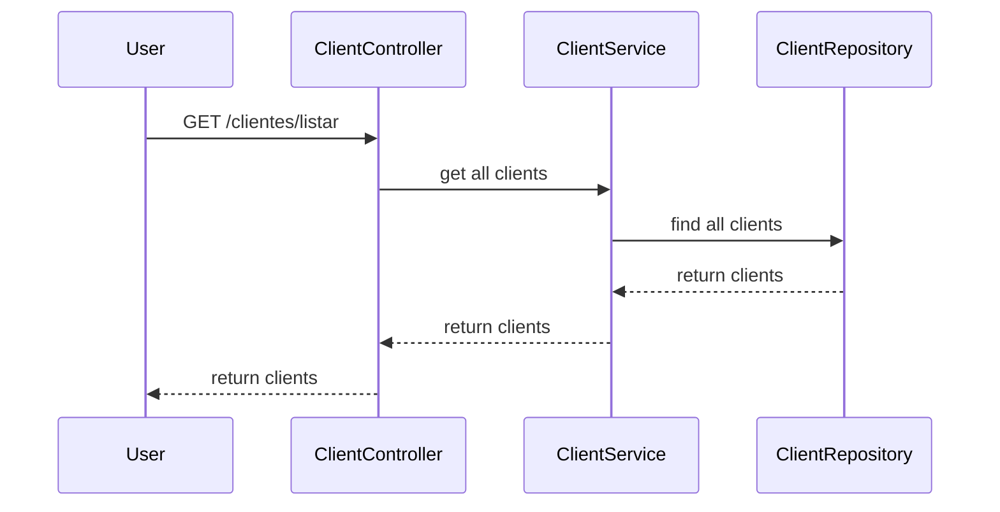

### Diagramas de secuencia

1 - Método POST `http://localhost:8080/clientes/crear`

2 - Método DELETE con parámetro username `http://localhost:8080/clientes/eliminar?username=xxxx`

3 - Método PUT `http://localhost:8080/clientes/actualizar`

4 - Método GET con parámetro username `http://localhost:8080/clientes/buscar?username=xxxxxx`

5 - Método GET sin parámetro

